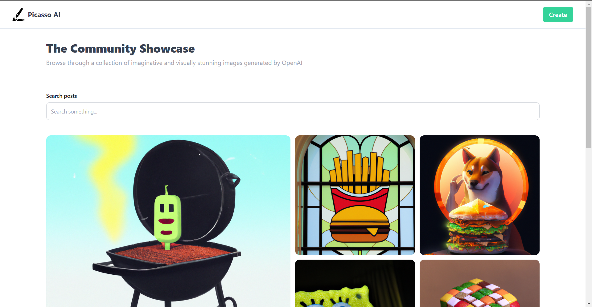
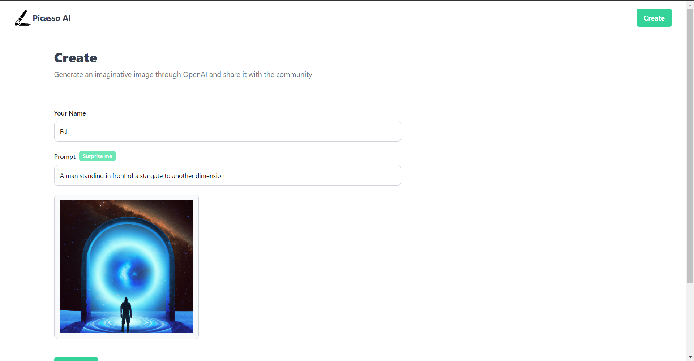

# Picasso

Picasso AI is a powerful DALL-E clone that uses OpenAPI to generate images from text. Built with ReactJS, Vite, TypeScript, and Tailwind CSS, it's the ultimate tool for creating stunning visuals with ease.

## Deploy Status

## Link

https://picassoai.vercel.app/

## Screenshot

   

## Built With

- ReactJs with TypeScript
- TailwindCss
- MongDB
- Cloudinary
- OpenAI
